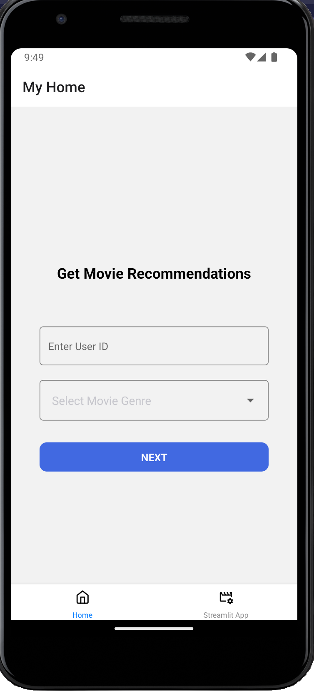
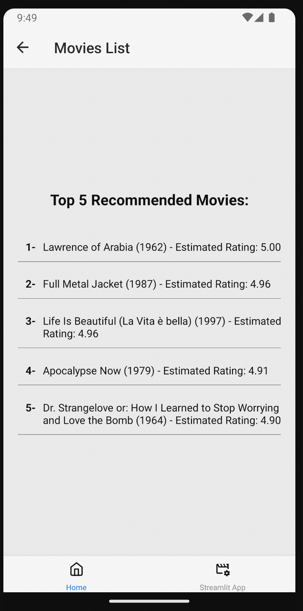
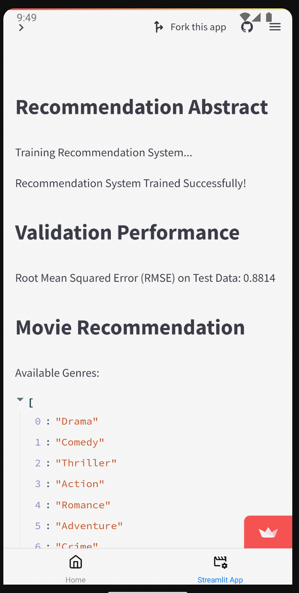

# ML iOS APP

## Requirements

For development, you will only need Node.js installed on your environment.
And please use the appropriate [Editorconfig](http://editorconfig.org/) plugin for your Editor (not mandatory).

### Node

[Node](http://nodejs.org/) is really easy to install & now include [NPM](https://npmjs.org/).
You should be able to run the following command after the installation procedure
below.

    $ node --version
    v16.20.2

    $ npm --version
    v8.19.4

#### Node installation on OS X

You will need to use a Terminal. On OS X, you can find the default terminal in
`/Applications/Utilities/Terminal.app`.

Please install [Homebrew](http://brew.sh/) if it's not already done with the following command.

    $ ruby -e "$(curl -fsSL https://raw.github.com/Homebrew/homebrew/go/install)"

If everything when fine, you should run

    brew install node

#### Node installation on Linux

    sudo apt-get install python-software-properties
    sudo add-apt-repository ppa:chris-lea/node.js
    sudo apt-get update
    sudo apt-get install nodejs

## Environment setup

- Follow thee steps mentioned here [Expo React Native](https://reactnative.dev/docs/environment-setup?guide=quickstart)

## Install Dependencies

    $ npm install

## Start & watch

    $ npx expo start

## Languages & tools

### JavaScript

- [React-Native](https://reactnative.dev/)

### App Demo

